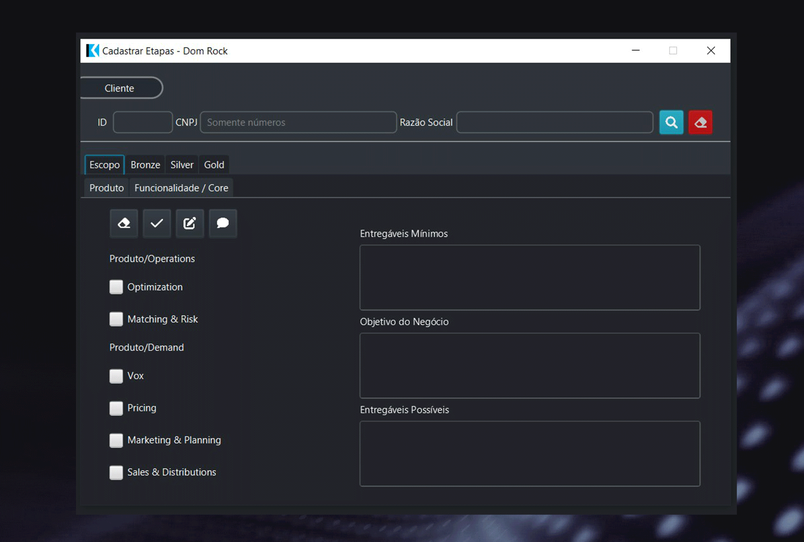

# Projeto 2: 1º Semestre de 2022 

## Reposiório do Projeto

[Dom Rock - Fluffy Fatec](https://github.com/fluffyfatec/Dom_Rock)

## Parceiro Acadêmico

Dom Rock

## Visão do Projeto

O desafio é criar um sistema para gerenciar a ativação dos clientes na plataforma Dom Rock. Essa solução deve permitir a entrada de parâmetros específicos de cada cliente, alocar recursos, realizar estimativas de consumo, gerar relatórios e ter uma base de dados preparada para integrações futuras.

A Fluffy API desenvolveu o Sistema de Gerenciamento de Clientes - Dom Rock, uma aplicação desktop em Java. Ele possibilita o cadastro, armazenamento e edição dos dados dos clientes, gera relatórios, registra logs e oferece diferentes níveis de acesso para maior segurança dos dados. Essa solução visa proporcionar uma gestão abrangente e segura para a ativação e administração dos clientes na plataforma Dom Rock.

## Tecnologias Adotadas na Solução

### Java

A linguagem Java foi utilizada em todo o back-end da aplicação. Foram desenvolvidas, com a linguagem, diversas funcionalidades da aplicação, como a configuração da lógica para a utilização dos dados armazenados no banco de dados, a configuração de todos os dados do sistema para que os eles possam ser consumidos pelo front-end, como também toda a arquitetura presente, e a segurança da aplicação via nível de acesso.  

Para saber mais, acesse: [Java](https://www.java.com)

### JavaFX Scene Builder Archive

O JavaFX Scene Builder é uma ferramenta de design visual desenvolvida pela Oracle para criar interfaces gráficas de usuário (GUIs) para aplicativos JavaFX. Com ela foi efetuada a utilização dos dados enviados do back-end para o front-end, desenvolvendo telas para a movimentação dos dados, como inserção, deleção, atualização e visualização. Toda a interface do projeto foi desenvolvida pensando na dinâmica do fluxo do projeto e buscando uma forma prática e objetica de utilização.

Para saber mais, acesse: [JavaFX Scene Builder Archive](https://www.oracle.com/java/technologies/javafxscenebuilder-1x-archive-downloads.html)

### SQL Server Nuvem Azure

O SQL Server no Azure é a versão do Microsoft SQL Server que é executada na nuvem da Microsoft, conhecida como Microsoft Azure. Ela que foi utilizada para o armazenamento dos dados da aplicação. Com ele, foram feitas as criações de tabelas, views e triggers, e era feito o gerenciamento dos dados.

Para saber mais, acesse: [SQL Server Nuvem Azure](https://azure.microsoft.com/pt-br/products/azure-sql/database/)

## Contribuições Pessoais

Desenvolvi um aplicativo web dedicado à análise dos dados da pandemia de COVID-19 em São Paulo. Utilizei Python e o framework Dash para criar uma interface interativa e informativa. O processo envolveu desde o pré-processamento dos dados CSV com Pandas até a implementação de gráficos variados e funcionalidades interativas, como filtros de dados e seleção de municípios.

O aplicativo oferece uma experiência responsiva aos usuários, com Dash Bootstrap Components garantindo um design intuitivo e adaptável. Funcionalidades como filtragem de dados em tabelas e atualização dinâmica de gráficos permitem uma análise detalhada da situação epidemiológica.

Esse aplicativo proporciona uma plataforma completa para visualização e análise dos dados da COVID-19 em São Paulo. Com sua interface interativa e funcionalidades avançadas, os usuários podem explorar estatísticas atualizadas e informações detalhadas, auxiliando na compreensão e na tomada de decisões informadas sobre a pandemia.

## Aprendizados Efetivos

<h3 align="center"> Hard Skills </h3>

<table align="center">
    <tr>
      <th width="300px">Tecnologia/Metodologia</th>
      <th width="300px">Classificação</th>
    </tr>
    <tr>
      <td>Java</td>
      <td>Sei fazer com Ajuda</td>
    </tr>
    <tr>
      <td>JavaFX</td>
      <td>Sei fazer com Ajuda</td>
    </tr>
    <tr>
      <td>SQL Serve Azure Cloud</td>
      <td>Entendi</td>
    </tr>
    <tr>
      <td>GIT</td>
      <td>Sei fazer com Ajuda</td>
    </tr>
</table>

<h3 align="center"> Soft Skills </h3>

<table align="center">
    <tr>
      <th width="300px">Habilidade</th>
      <th width="300px">Descrição</th>
    </tr>
    <tr>
      <td>Comunicação</td>
      <td>Precisei me comunicar com a equipe sobre situações e status de tarefas</td>
    </tr>
    <tr>
      <td>Resolução de Problemas</td>
      <td>Precisei entender e buscar formas de resolver problemas encontrados durante o projeto</td>
    </tr>
    <tr>
      <td>Trabalho em Equipe</td>
      <td>Precisei entender e adaptar a forma de trabalho para colaborar com a equipe no desenvolimento do projeto</td>
    </tr>
</table>
